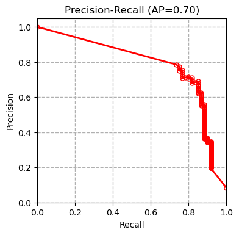
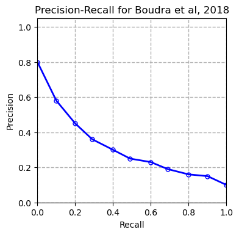

# Tree Bark Identification Using Radiomics 
Since the term radiomics was first coined in 2012, it has widely been used for medical image analysis. Radiomics is a method that automatically extracts a large of number of different features from medical images. These features have been able to uncover characteristics that can differentiate tumoral tissue from normal tissue and tissue at different stages of cancer.

In this repository, we aim to show that radiomic features can be useful for analysis of images in other domains as well. As a example, we show that radiomic features can be used for tree bark identification. We use a public dataset of tree bark images available [here](https://www.vicos.si/resources/trunk12/). All the code is provided in the notebook file: 

```tree_bark_analysis.ipynb```

We have compared our results with those of a published paper [Boudra et al, 2018] on this dataset which uses a different texture descriptor for classification of tree barks. 

XGBoost  | SVM | Random Forest
:-------------:|:-------------:|:-------------:
  |   | 

Linear Regression | SGD  | Boudra et al. 2018
:-------------:|:-------------:|:-------------:
 |  

# Reference 
```
@inproceedings{boudra2018bark,
  title={Bark identification using improved statistical radial binary patterns},
  author={Boudra, Safia and Yahiaoui, Itheri and Behloul, Ali},
  booktitle={2018 International conference on content-based multimedia indexing (CBMI)},
  pages={1--6},
  year={2018}
}
```