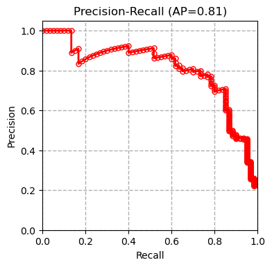
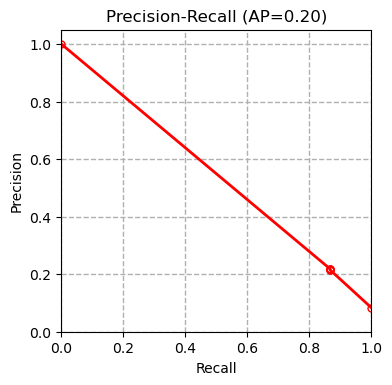

# Using Radiomics for Tree Bark Identification
Since the term radiomics was first coined in 2012, it has widely been used for medical image analysis. Radiomics is a method that automatically extracts a large of number of different features from medical images. These features have been able to uncover characteristics that can differentiate tumoral tissue from normal tissue and tissue at different stages of cancer.

In this repository, we aim to show that radiomic features can be useful for analysis of images in other domains as well. As a example, we show that radiomic features can be used for tree bark identification. We use a public dataset of tree bark images which can be found [here](https://www.vicos.si/resources/trunk12/). All the code is provided in the notebook file: 

```tree_bark_identification.ipynb```

## Evaluation results
Radiomic features were extracted from tree bark images and the values were normalized to the range ```[0,1]```. Different classification models such as XGBoost, Support Vector Machine (SVM), Random Forest were applied to the acquired radiomic features after normalization. We have compared our results with the results of the paper (Boudra et al, 2018) for this dataset in the table below. Boudra et al. propose a novel texture descriptor and use this descriptor to guide classification of tree bark images.

XGBoost  | SVM | Random Forest
:-------------:|:-------------:|:-------------:
  |   | 

Logistic Regression | SGD  | Boudra et al. 2018
:-------------:|:-------------:|:-------------:
 |  | 

*AP* refers to average precision. The measurements are done using *micro averaging*. Our results show that the SVM classifier outperforms all the other methods. Other evaluation metrics reported in the following confirm this conclusion. 

## Other evaluation metrics

In the following table, we compare the performance of each classification model using different evaluation metrics: 

Classifier | XGBoost |SVM | Random Forest | Linear Regression | SGD | Boudra et al. (2018)
:-------------:|:-------------:|:-------------:|:-------------:|:-------------:|:-------------:|:-------------:
Precision | 0.660	|0.703	|0.603	|0.680	|0.513| -
Recall | 0.656	|0.699	|0.603	|0.679	|0.501| -
Accuracy | 0.656	|0.699	|0.603	|0.679	|0.501| 0.677
AUC | 0.935	|0.953	|0.914	|0.950| 0.751 | -
F1 | 0.638	|0.682	|0.580	|0.663	|0.445| -

All measurements are done using *weighted averaging*. 


# Reference 
```
@inproceedings{boudra2018bark,
  title={Bark identification using improved statistical radial binary patterns},
  author={Boudra, Safia and Yahiaoui, Itheri and Behloul, Ali},
  booktitle={2018 International conference on content-based multimedia indexing (CBMI)},
  pages={1--6},
  year={2018}
}
```